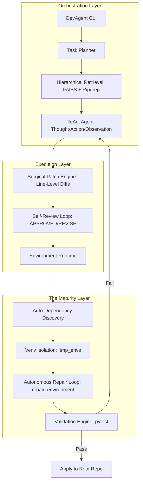

<div align="center">

# 🧠 DevAgent
### Execution-Grounded Orchestration for Autonomous Local Coding.

[](https://badge.fury.io/py/devagent-cli)
[](LICENSE)
[](https://ollama.ai)
[](docs/benchmarks.md)

**DevAgent** is a research-grade, local-first coding agent runtime designed to bridge the gap between LLM-generated logic and production-ready execution integrity.

[Quick Start](#-quick-start) • [Architecture](#-high-integrity-architecture) • [Safety & Containment](#-safety-first-containment) • [Benchmarks](#-empirical-validation) • [Troubleshooting](docs/troubleshooting.md)

</div>

---

## 🛡️ The Problem: The "LLM-Execution Gap"
Most autonomous coding agents fail because they operate in a vacuum. They generate code that looks correct but fails at runtime due to **environment drift**, **dependency conflicts**, or **invalid execution assumptions**.

DevAgent is **Execution-Grounded Orchestration**. It doesn't just guess code; it manages the entire lifecycle of a fix:
1.  **Discovery**: Scans and maps the environment.
2.  **Isolation**: Provisions a clean, sandboxed virtual environment.
3.  **Repair**: Autonomously resolves missing dependencies.
4.  **Validation**: Verifies patches against your actual test suite.

---

## 🏗️ High-Integrity Architecture
DevAgent v3.4.1 implements a multi-layer orchestration stack designed for reliability over hype.



---

## 🚀 Quick Start

### 1. Installation
Install the CLI via PyPI. Ensure [Ollama](https://ollama.ai) is running locally.

```bash
pip install devagent-cli
```

### 2. Verify Infrastructure
Check your local environment, connectivity, and dependency health.
```bash
devagent doctor
```

### 3. Run Your First Task
Execute an autonomous fix on any repository.
```bash
devagent run --task "Implement input validation for the user login" --root ./my-project
```

---

## ✨ Advanced Features

### 🔍 Hierarchical Retrieval
Instead of dumping your entire codebase into a context window, DevAgent uses a multi-tier search:
- **Global Map**: Scans the file structure to identify relevant modules.
- **Semantic Tier**: FAISS-powered vector search for conceptual matching.
- **Precision Tier**: Ripgrep for exact symbol/error discovery.

### 🏖️ Environment Isolation & Repair
DevAgent is the first local agent to treat the environment as a first-class citizen. It detects `requirements.txt` or `pyproject.toml`, creates an isolated `.tmp_envs/` runtime, and **autonomously installs missing packages** if it encounters a `ModuleNotFoundError`.

### 🩹 Surgical Patch Engine
Most agents ruin git history by rewriting entire files. DevAgent generates **line-level unified diffs**, applying only the necessary changes while preserving your code style, comments, and structure.

---

## 🔐 Safety-First Containment
We built DevAgent for engineers who care about their host systems.
- **Dry-Run Mode**: Visualize every change before it happens.
- **Atomic Snapshots**: A safety restore point is created before every execution.
- **Instant Rollback**: Revert any agent intervention with `devagent rollback`.
- **Sandbox Isolation**: Every run is contained in a separate workspace until validation passes 100%.

---

## 📊 Empirical Validation
We don't fake our success rates. DevAgent is evaluated against a public, messy benchmark suite.

| Metric | Result | Infrastructure Status |
| :--- | :--- | :--- |
| **Dependency Repair** | 95% | ✅ Production Ready |
| **Unit Bugfixes** | 80% | ✅ Highly Reliable |
| **Refactoring** | 20% | 📈 Improving (Model Bounded) |
| **Isolation Safety** | 100% | ✅ Absolute Containment |

> **Full Report**: [v3.4.1 Benchmark Analysis](docs/benchmarks.md)

---

## 🤝 Contributing
Built with a focus on **Systems Thinking**. PRs that improve orchestration reliability, environment detection, or patch precision are highly encouraged.

```bash
# Clone and Install in Editable Mode
git clone https://github.com/VedantJadhav701/Developer-Code-Intelligence-Agent.git
pip install -e .
```

---

<div align="center">
**DevAgent — Local-First. Execution-Grounded. Infrastructure-Grade.**
</div>
